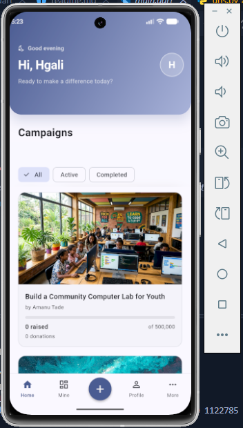
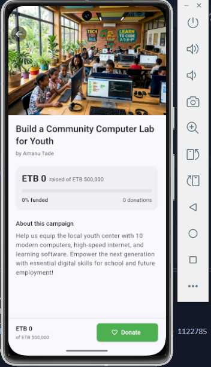
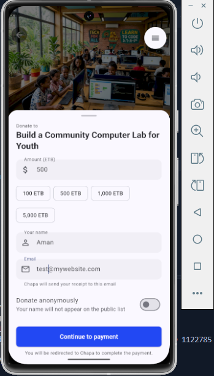
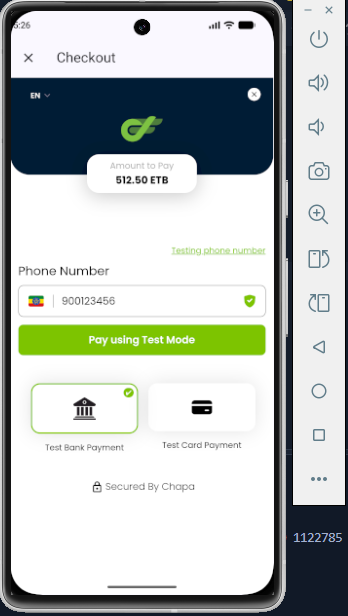
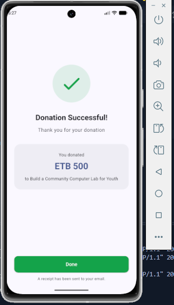
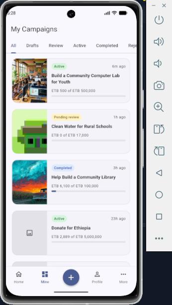
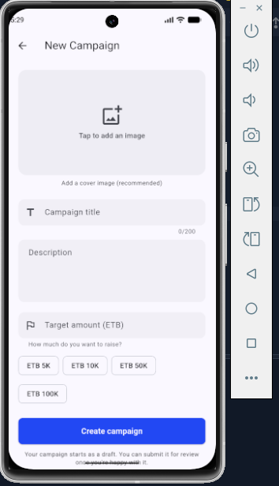
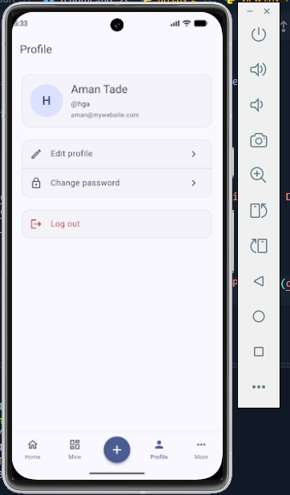

# Chapa Donation Platform


A full-stack donation platform for Ethiopian fundraising campaigns, with a Django REST backend and a Flutter mobile client. Built around **Chapa** as the payment gateway, with server-side payment verification, campaign lifecycle management, and a GoFundMe-style donor wall.
---

## What it does

Users can browse public campaigns and donate without an account. Campaign owners can create, edit, and manage fundraising campaigns through a full status workflow (`Draft → Pending Review → Active → Completed`). Admins approve campaigns before they go live. Every donation is verified server-side against the Chapa API — never trusted from the client — before being marked as successful.

### Highlights

- **Real payment integration** with Chapa (Ethiopian payment gateway)
- **Dual verification path**: Django return URL + server-side verification against Chapa's API
- **JWT authentication** with refresh tokens, blacklisting, and inactive-user handling
- **Campaign lifecycle** with enforced state transitions and editable-fields rules per status
- **Donor wall** showing successful donations (public view hides email and internal references)
- **Optimistic UI** with pull-to-refresh, infinite scroll, and shimmer skeletons
- **Fully typed** Flutter client using Bloc for state management
---

## Screenshots

| Home | Campaign Detail | Donation |
|:---:|:---:|:---:|
|  |  |  |

| Chapa UI | Payment Return | My Campaigns |
|:---:|:---:|:---:|
|  |  |  |

| Create Campaign | Profile | |
|:---:|:---:|:---:|
|  |  | |
---

## Tech stack

### Backend
- **Django 6** + **Django REST Framework**
- **PostgreSQL** 
- **SimpleJWT** for authentication
- **django-redis** for rate-limiting 
- **Cloudflare Tunnel** for local webhook testing
- **Pillow** for image processing

### Frontend
- **Flutter** (Dart 3)
- **flutter_bloc** for state management
- **dio** for HTTP with an auth interceptor and automatic token refresh
- **flutter_inappwebview** for the Chapa checkout flow
- **flutter_secure_storage** for JWT persistence
- **cached_network_image**, **image_picker**, **shimmer**

### Infrastructure
- **Chapa** — payment gateway
- **Cloudflare Tunnel** — public URL for local dev webhooks
- **Redis** — shared cache for verifying cooldowns across workers

---

## Project structure

```text
chapa-flutter-django/
├── backend/                  # Django REST API
│   ├── core/                 # Main settings, urls, wsgi
│   ├── users/                # Custom user model, profiles, JWT endpoints
│   ├── campaigns/            # Campaign CRUD, workflow states, donor wall
│   ├── payments/             # Chapa initialization, webhook, verification
│   └── requirements.txt
│
├── flutter_frontend/         # Flutter mobile app
│   ├── lib/
│   │   ├── bloc/             # BLoC state management (auth, campaigns, etc.)
│   │   ├── models/           # Dart data models (Campaign, Donation, User)
│   │   ├── repositories/     # API service layer (Dio integration)
│   │   ├── screens/          # UI pages (Home, Detail, Checkout, Profile)
│   │   ├── widgets/          # Reusable widgets (cards, shimmers, buttons)
│   │   └── main.dart
│   └── pubspec.yaml
│
└── docs/                     # Documentation and screenshots
```
---

## Prerequisites & Installation

Make sure you have the following installed on your machine:
- **Python** 3.10+
- **Flutter SDK** 3.x+
- **PostgreSQL** (optional for dev, SQLite is used by default)
- **Git**

---

### Backend Setup (Django)

1. **Clone the repository and navigate to the backend:**
   ```bash
   git clone [https://github.com/elamany/chapa-flutter-django.git](https://github.com/elamany/chapa-flutter-django.git)
   cd chapa-flutter-django/backend```
---

### Create and activate a virtual environment

Create an isolated Python environment to keep your project dependencies clean:
```bash
python -m venv venv
```
---

### Activate the virtual environment depending on your operating system:

- **On Windows (Command Prompt / PowerShell):**
  ```bash
  venv\Scripts\activate
  ```
- **On macOS / Linux:**
  ```bash
  source venv/bin/activate
  ```
---

### Install dependencies

Install all required Python packages using pip:
```bash
pip install -r requirements.txt
```
---

### Configure environment variables

Create a `.env` file inside your `backend/` directory and add your configuration keys:
```env
SECRET_KEY=your-django-secret-key
DEBUG=True
ALLOWED_HOSTS=localhost,127.0.0.1,your-tunnel-url.trycloudflare.com

CHAPA_SECRET_KEY="CHASECK_TEST-****" 
CHAPA_WEBHOOK_SECRET=Your secret key
CHAPA_RETURN_URL=https://your-tunnel.trycloudflare.com
BACKEND_URL=https://your-tunnel.trycloudflare.com
```

---

### Run migrations and start the server

Apply database migrations to set up your database schema:
```bash
python manage.py migrate
```
Start the Django development server:
```bash
python manage.py runserver 0.0.0.0:8000
```
### Local Webhook Testing (Optional)

If you need to test payment webhooks locally using Cloudflare Tunnel, run:
```bash
cloudflared tunnel --url http://localhost:8000
```

Make sure to copy the generated public HTTPS URL and update your `CHAPA_RETURN_URL` and `BACKEND_URL` in your backend `.env` file, as well as configuring it inside your Chapa dashboard webhook settings.

---

## Flutter Frontend Setup

1. Navigate to the frontend directory:
   ```bash
   cd flutter_frontend
   ```

2. Install dependencies:
   ```bash
   flutter pub get
   ```
3. Run the app:
   ```bash
   flutter run
   ```
### Connection Refused on Emulator / Device
- **Android Emulator:** Use `http://10.0.2.2:8000/api/` instead of `localhost` or `127.0.0.1`.
- **Physical Device:** Ensure your computer and phone are on the exact same Wi-Fi network, and use your computer's local IP address (e.g., `http://192.168.x.x:8000/api/`). Also, make sure your firewall allows incoming traffic on port `8000`.

### Clear Cache & Rebuild
If you experience strange compilation bugs after changing dependencies or configuration files, run a deep clean:
```bash
flutter clean
flutter pub get
flutter run
```

## API Overview

### Auth (`/api/v1/auth/`)

| Method | Endpoint | Purpose |
| :--- | :--- | :--- |
| `POST` | `/register/` | Create account |
| `POST` | `/token/` | Login (returns access + refresh) |
| `POST` | `/token/refresh/` | Refresh access token |
| `POST` | `/logout/` | Blacklist refresh token |
| `GET` | `/me/` | Current user |
| `PATCH` | `/me/` | Update name / email |
| `POST` | `/change-password/` | Change password (invalidates other sessions) |

---

### Campaigns (`/api/v1/`)

| Method | Endpoint | Purpose |
| :--- | :--- | :--- |
| `GET` | `/campaigns/` | Public list (active + completed) |
| `GET` | `/campaigns/<id>/` | Public detail |
| `POST` | `/campaigns/` | Create campaign (auth required) |
| `GET` | `/my-campaigns/` | Owner's campaigns, filterable by `?status=` |
| `GET`/`PATCH`/`DELETE` | `/my-campaigns-detail/<id>/` | Owner CRUD operations |
| `POST` | `/my-campaigns/<id>/submit-for-review/` | Draft → Pending Review |
| `POST` | `/my-campaigns/<id>/cancel-review-submission/` | Pending Review → Draft |
| `POST` | `/my-campaigns/<id>/mark-campaign-complete/` | Active → Completed |
| `PATCH` | `/admin/campaigns/<id>/status/` | Admin status override |

---

### Donations & Payments

| Method | Endpoint | Purpose |
| :--- | :--- | :--- |
| `POST` | `/campaigns/<id>/donate/` | Start web donation |
| `GET` | `/campaigns/<id>/donations/` | Public donor wall (success only) |
| `GET` | `/my-campaigns/<id>/donations/` | Owner list (all statuses) |
| `GET` | `/payments/return/?tx_ref=` | Chapa redirect target (HTML result) |
| `POST` | `/payments/webhook/` | Chapa server-to-server notification |
| `GET` | `/payments/verify/<tx_ref>/` | Manual verification (rate-limited fallback) |

## License

This project is licensed under the MIT License.

```text
MIT License

Copyright (c) 2026 @elamany
```
---

## Support & Contact

If you encounter any issues or have questions regarding the setup process, feel free to open an issue in the GitHub repository or reach out to the project maintainers.